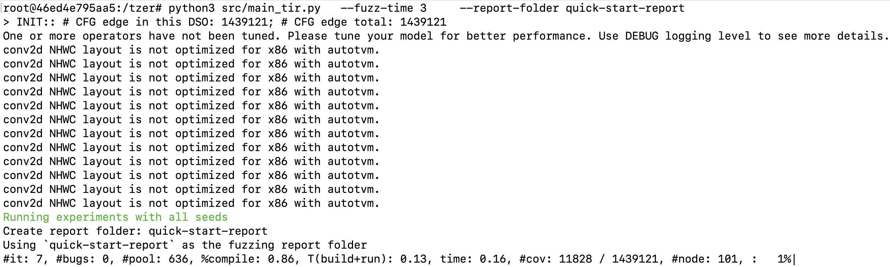

<p align="center">
    
</p>

<p align="center">
    
    
    
	<a href="https://colab.research.google.com/github/Tzer-AnonBot/tzer/blob/main/bug-report.ipynb" title="Colab"></a>
    <a href="https://hub.docker.com/repository/docker/tzerbot/oopsla" title="Docker"></a>
</p>


---

<p align="center">
    <a href="#Reproduce-Bugs">Reproduce Bugs</a>  •
    <a href="#Quick-Start">Quick Start</a> •
    <a href="#Installation">Installation</a> •
    <a href="#Extend-Tzer">Extend Tzer</a>
</p>

# Coverage-Guided Tensor Compiler Fuzzing with Joint IR-Pass Mutation

This is the artifact of Tzer for anonymous review in OOPSLA'22. 

## Reproduce Bugs

Till submission, Tzer has been detected **40** bugs for TVM with **30 confirmed** and **24 fixed** (merged in the latest branch). Due to the anonymous review policy of OOPSLA, the links of actual bug reports will be provided after the review process.

We provide strong reproducibility of our work. **To reproduce all bugs, all you need to do is a single click [](https://colab.research.google.com/github/Tzer-AnonBot/tzer/blob/main/bug-report.ipynb) on your browser**. Since some bugs need to be triggered by some complex GPU settings, to maximumly ease the hardware and software effort, the bugs are summarized in a Google Colab environment (No GPU required, but just a browser!).

## Quick Start

You can easily start using Tzer with [docker](https://docs.docker.com/get-docker/).

```shell
docker run --rm -it tzerbot/oopsla

# Inside the image.
cd tzer
python3 src/main_tir.py --fuzz-time 10     --report-folder ten-minute-fuzz
#                       run for 10 min.    bugs in folder `ten-minute-fuzz`
```

Successful installation looks like:




<details><summary><b>Report folder contents</b> <i>[click to expand]</i></summary>
<div>

- `cov_by_time.txt`: a csv file where columns means "time" (second) and basic-block coverage;
- `${BUG_TYPE}_${BUG_ID}.error_message.txt`: error message snapshot of failures;
- `${BUG_TYPE}_${BUG_ID}.ctx`: context data to reproduce bugs (stored in Pickle. See [config.py](src/tzer/context.py#L51))
- `meta.txt`: metadata including git version of TVM and experiment time;
- `tir_by_time.pickle`: generated <F, P> (i.e., TIR and Passes) files (if `TIR_REC=1` is set);
- `valid_seed_new_cov_count.txt`: number of generated valid tests with new coverage;

</div>
</details>

<details><summary><b>Main commandline options</b> <i>[click to expand]</i></summary>
<div>
Commandline options (added as tail of commands):

- `--fuzz-time`: Time budget of fuzzing (minute);
- `--tolerance`: Parameter $N_{max}$ in the paper (control the interleaving of IR and pass mutation);
- `--report-folder`: Path to store results (e.g., coverage trend);

Environment variables to control the algorithm options (added the prefix of commands):

- `PASS=1` to enable pass mutation;
- `NO_SEEDS=1` to disable initial seeds (start from an empty function);
- `NO_COV=1` to disable the coverage feedback;
- `TIR_REC=1`to record generated TIR files (for evaluating non-coverage version);
</div>
</details>

<details><summary><b>Reproduce ablation study</b> <i>[click to expand]</i></summary>
<div>

```shell
# (1): General IR Mutation (No Coverage)*
TIR_REC=1 NO_COV=1 python3 src/main_tir.py --fuzz-time 240 --report-folder ablation-1
python3 src/get_cov.py --folders ablation-1 # Evaluate samples on instrumented TVM to get coverage results.

# (2): (1) + Coverage Guidance
python3 src/main_tir.py --fuzz-time 240 --report-folder ablation-2

# (3): (2) + Domain-Specific IR Mutation
LOW=1 python3 src/main_tir.py --fuzz-time 240 --report-folder ablation-3

# (4): (3) + Random Pass Mutation
PASS=1 RANDOM_PASS=1 LOW=1 python3 src/main_tir.py --fuzz-time 240 --report-folder ablation-4

# (5): (3) + Evolutionary IR-Pass Mutation
# aka: Best Tzer! Pleasse use this command if you want to compare Tzer with your own system~
PASS=1 LOW=1 python3 src/main_tir.py --fuzz-time 240 --report-folder ablation-5 --tolerance 4
```

**In experimental results posted in the paper, non-coverage baselines leverage TVM without instrumentation. Here for demo usage, coverage feedback is not used but the TVM is instrumented. To use non-instrumented TVM, we need to compile TVM w/o instrumentation and reset TVM_HOME and PYTHONPATH.*
</div>
</details>

## Installation

<details><summary><b>Expected requirements</b> <i>[click to expand]</i></summary>
<div>

- **Hardware**: 8GB RAM; 256G Storage; X86 CPU; Good Network to GitHub; [Docker](https://docs.docker.com/get-docker/) (for Docker installation)
- **Software**: Linux (tested under Manjaro and Ubuntu20.04. Other Linux distributions should also work)

</div>
</details>

We provide 3 methods for installing Tzer:

<details><summary><b>Docker Hub (Recommended, Out-of-the-box!)</b> <i>[click to expand]</i></summary>
<div>

Directly run Tzer in pre-built container image! Make sure you have [docker](https://docs.docker.com/get-docker/) installed.

```shell
docker run --rm -it tzerbot/oopsla
```
</div>
</details>

<details><summary><b>Docker Build (10~20 min., for customized development)</b> <i>[click to expand]</i></summary>
<div>
Build Tzer under a docker environment! Make sure you have [docker](https://docs.docker.com/get-docker/) installed.

1. `git clone https://github.com/Tzer-AnonBot/tzer.git && cd tzer`
2. `docker build --tag tzer-oopsla:eval .`
3. `docker run --rm -it tzer-oopsla:eval`

</div>
</details>

<details><summary><b>Manual Build (20~30 min., for customized dev. and native performance)</b> <i>[click to expand]</i></summary>
<div>
Build Tzer natively on your Linux:

Prepare dependencies:

```shell
# Arch Linux / Manjaro
sudo pacman -Syy
sudo pacman -S compiler-rt llvm llvm-libs compiler-rt clang cmake git python3
# Ubuntu
sudo apt update
sudo apt install -y libfuzzer-12-dev # If you fail, try "libfuzzer-11-dev", "-10-dev", ...
sudo apt install -y clang cmake git python3
```

Build TVM and Tzer:

```shell
git clone https://github.com/Tzer-AnonBot/tzer.git
cd tzer/tvm_cov_patch

# Build TVM with intruments
bash ./build_tvm.sh # If you fail, check the script for step-by-step instruction;
cd ../../../
# If success, tvm is installed under `tvm_cov_patch/tvm`

# Install Python dependency
python3 -m pip install -r requirements.txt

# Set up TVM_HOME and PYTHONPATH env var before using TVM and Tzer.
export TVM_HOME=$(realpath tvm_cov_patch/tvm)
export PYTHONPATH=$TVM_HOME/python
```
</div>
</details>


## Extend Tzer

We implemented many re-usable functionalities for future and open research! To easily implement other coverage-guided fuzzing algorithm for TVM, after your installing TVM with [memcov](https://github.com/Tzer-AnonBot/memcov) by applying `tvm_cov_patch/memcov4tvm.patch` to TVM (See [tvm_cov_patch/build_tvm.sh](tvm_cov_patch/build_tvm.sh)), you can get current coverage of TVM by:

```python
from tvm.contrib import coverage

print(coverage.get_now()) # Current visited # basic blocks
print(coverage.get_total()) # Total number of # basic blocks

coverage.push() # store current coverage snapshot to a stack and reset it to empty (useful for multi-process scenario)
coverage.pop()  # merge the top snapshot from the stack. 
```

**Usage `push-pop` combo**: Some times the target program might crash, but we don't want the fuzzer to be affected by the failure. Therefore, you can set a "safe guard" by:

1. push: save current snapshot and reset the coverage hitmap;
2. raise a sub-process to compile target IR & passes with TVM;
3. pop: merge the snapshot of the sub-process and last stored snapshot (top of the stack) to get a complete coverage.

Latency of the combo is optimized to ~1ms as we applied bit-level optimization.
